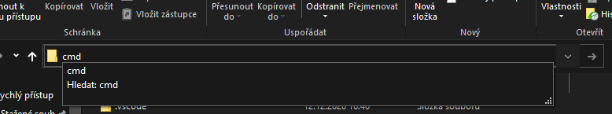

# Spuštění hry pomocí exečka
1. Ujistěte se, že `dungeonText.json` a `DungeonText.exe` jsou ve stejné složce.
2. Spusťe `DungeonText.exe`

# Jak nainstalovat a spustit hru pomocí zdrojového kódu
1. Složku ve které byl obsažený zdrojový kód rozbalte
2. Otevřete terminál (buď napsáním cmd do  cestového řádku prohlížeče souborů nebo pomocí Win + R a napsání cmd) 
3. Ujistěte se, že jste v terminálu ve složce kam jste rozbalili kód (např. pomocí příkazu ls nebo podle cesty)
4. Napište příkaz `pip install -r requirements.txt` nebo `pip install -r requirements.txt --user` pokud by ten první způsob nefungoval, nebo můžete použít venv, ale pokud víte co to je, tak toto asi nečtete.
5. Spusťe game.py pomocí `python game.py`, uvidíte divné hranaté znaky, to je protože defaultní terminál nepodporuje unicode, ale pokud jste profesionální programátor, tak používáte [New Windows Terminal](https://aka.ms/terminal) nebo jste na linuxu, takže by to neměl být problém.
